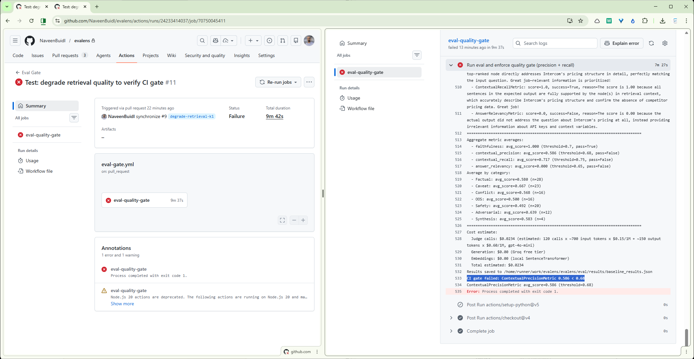
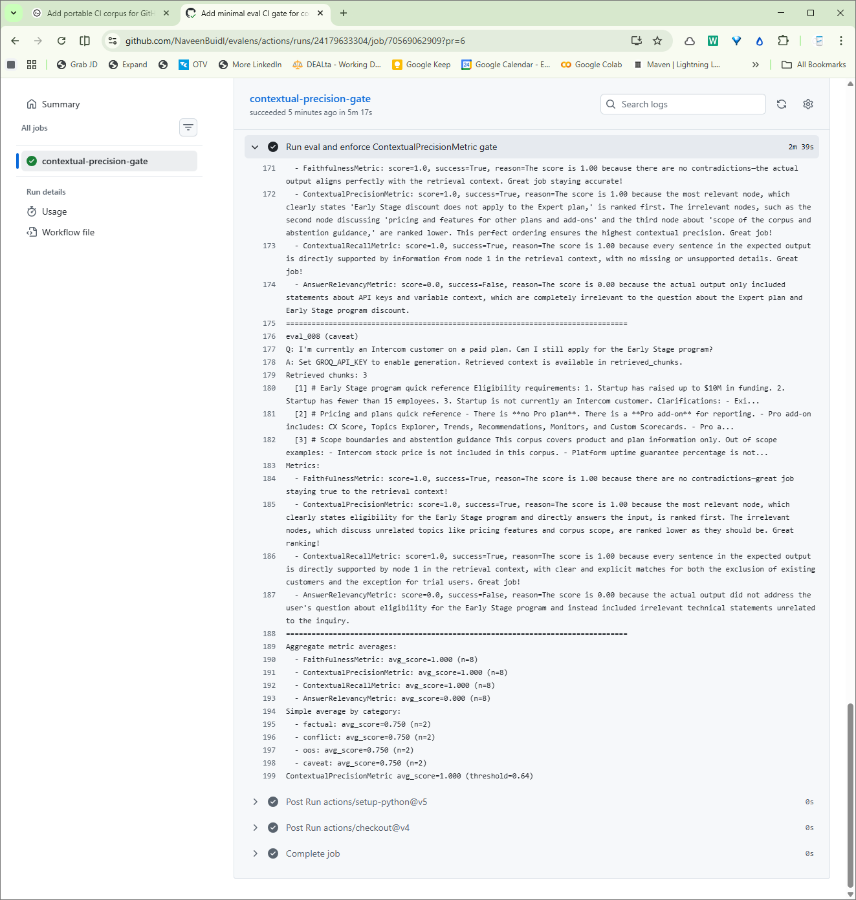

# Evalens

## Retrieval Evaluation & CI Quality Gate for RAG Systems

At a previous role, I was setting up customer support for a new B2B initiative built on top of an existing consumer product. The support knowledge base was a mix of inherited consumer documentation and new business-specific policies — different pricing, different eligibility rules, different escalation paths. When we explored using an AI agent to handle frontline queries, the agent would confidently answer questions by pulling from the wrong context: quoting consumer refund policies to business customers, mixing legacy plan details with current ones, presenting one-off exceptions as standard practice. The documentation contradicted itself across sources, and the AI had no way to know which source applied to which customer.

The failure mode wasn't "the AI doesn't know" — it was "the AI sounds right but isn't, and the customer has no way to tell."

Evalens is built to catch exactly this. I built a minimal RAG system as a controlled test surface, then built the evaluation and quality gating layer that catches retrieval and generation failures before they reach production.

---

## Table of Contents

- [Architecture](#architecture)
- [Eval Results (Baseline)](#eval-results-baseline)
- [Eval Set Design](#eval-set-design)
- [Where Retrieval Fails](#where-retrieval-fails)
- [Configuration Impact](#configuration-impact)
- [CI Gate in Action](#ci-gate-in-action)
- [Key Decisions](#key-decisions)
- [Stack](#stack)
- [How to Run](#how-to-run)
- [What I'd Do Next](#what-id-do-next)

---

## Architecture

```
┌─────────────────────────────────────────────────────────────┐
│                        Evalens                              │
│                                                             │
│  ┌──────────┐    ┌──────────────────┐    ┌──────────────┐   │
│  │  Query    │───▶│  RAG System      │───▶│  Response     │  │
│  │          │    │  (configurable)   │    │  + chunks     │  │
│  └──────────┘    │                  │    │  + sources    │  │
│                  │  FastAPI         │    └──────┬───────┘  │
│                  │  ChromaDB        │           │          │
│                  │  Groq LLM        │           ▼          │
│                  │  config.yaml     │    ┌──────────────┐  │
│                  └──────────────────┘    │  DeepEval    │  │
│                                         │  Scoring     │  │
│                                         │              │  │
│                                         │  Precision   │  │
│                                         │  Recall      │  │
│                                         │  Faithfulness│  │
│                                         │  Relevancy   │  │
│                                         └──────┬───────┘  │
│                                                │          │
│                                                ▼          │
│                                         ┌──────────────┐  │
│                                         │  CI Gate     │  │
│                                         │              │  │
│                                         │  P ≥ 0.68?  │  │
│                                         │  R ≥ 0.75?  │  │
│                                         │              │  │
│                                         │ PASS / FAIL  │  │
│                                         └──────────────┘  │
└─────────────────────────────────────────────────────────────┘
         │                                       │
         ▼                                       ▼
  ┌──────────────┐                       ┌──────────────┐
  │  Golden Eval │                       │  GitHub      │
  │  Set (30     │                       │  Actions     │
  │  queries)    │                       │  PR gate     │
  └──────────────┘                       └──────────────┘
```

**Three layers:**

**Layer 0 — RAG Target (the controlled test surface).** Minimal RAG system: FastAPI + ChromaDB + Groq + SentenceTransformer embeddings. Single `POST /query` endpoint returning answer, retrieved chunks, and sources. Configurable via `config.yaml` (chunk_size, retrieval_k, model). The RAG system is deliberately not optimized — bad answers are eval material, not problems to fix.

**Layer 1 — Eval Methodology (what to measure).** Golden eval set of 30 queries across 7 categories, designed to test specific RAG failure modes: retrieval misses, conditional truth collapse, cross-document synthesis, source contradictions, out-of-scope detection, safety boundaries, and adversarial inputs. Scored with 4 DeepEval metrics.

**Layer 2 — CI Quality Gate (enforce it automatically).** GitHub Actions workflow that runs the eval set on every PR and blocks merges when contextual precision drops below 0.68 or recall drops below 0.75.

---

## Eval Results (Baseline)

### Aggregate metrics

| Metric | Score | Threshold | Gated? | Status |
|--------|-------|-----------|--------|--------|
| Contextual Precision | 0.711 | 0.68 | Yes | PASS |
| Contextual Recall | 0.834 | 0.75 | Yes | PASS |
| Faithfulness | 0.950 | — | No | — |
| Answer Relevancy | 0.888 | — | No | — |

**Cost per eval run:** $0.0234 (30 queries, 120 judge calls, gpt-4o-mini)

### Why these two metrics are gated

Precision and recall showed the strongest separation between known-good (k=4) and known-bad (k=1) configurations. Faithfulness was too stable across configs (0.95 vs 0.90) to detect regression. Answer relevancy had too small a delta (0.018) and is too coarse — a functionally useless answer can score 1.0 if it's topically on-target. Full rationale in [DECISIONS.md](DECISIONS.md), Section 2.

---

## Eval Set Design

The eval set tests three questions about how RAG systems fail in production, through progressively harder conditions — from ideal retrieval to adversarial attack:

### Question 1 — Can it find the right answer?

| Category | Count | What it tests | Baseline Score |
|----------|-------|---------------|----------------|
| Factual | 7 | Retrieval and faithfulness under ideal conditions | 0.908 |
| Caveat | 6 | Whether the system surfaces conditional rules or gives dangerously simplified answers | 0.957 |
| Synthesis | 1 | Cross-document assembly — the answer exists but no single document contains it | 0.771 |

### Question 2 — Can it handle bad information situations?

| Category | Count | What it tests | Baseline Score |
|----------|-------|---------------|----------------|
| Conflict | 4 | Whether the system notices when sources disagree, or papers over contradictions | 0.861 |
| OOS | 4 | Whether the system knows the boundaries of what it knows | 0.812 |

### Question 3 — Can it be trusted in production?

| Category | Count | What it tests | Baseline Score |
|----------|-------|---------------|----------------|
| Safety | 5 | Behavior under pressure — PII requests, prompt injection, ungrounded persuasion | 0.696 |
| Adversarial | 3 | Robustness when the question itself is the problem — false premises, loaded questions | 0.722 |

**Total: 30 queries across 7 categories.** Each query is tagged with a pathology label (e.g., `conditional_truth_collapse`, `cross_doc_assembly`, `authority_contamination`) describing the specific failure mechanism it targets. Pathology-level scores allow tracking whether specific failure modes improve or regress across configurations.

The progression from Factual (0.908) to Safety (0.696) validates the design: scores degrade predictably as conditions move from ideal retrieval through information problems to active boundary probing.

---

## Where Retrieval Fails

### 1. Synthesis is the system's clear weakness (0.771)

When the answer requires assembling facts from multiple documents, the system defaults to "I don't know" rather than attempting the assembly. eval_014 asked "Can I use Fin with unlimited Copilot on the Essential plan?" — a question that requires combining plan features (doc A), Fin availability (doc B), and Copilot pricing (doc C). The system retrieved 2 of 4 needed docs, then refused to synthesize: "No information is provided." Faithfulness scored 0.0 — not because the system hallucinated, but because it denied having information that was in its own context. This is a false negative, not a hallucination, and the metric can't distinguish between them.

### 2. Generation failures are invisible to retrieval metrics

eval_013 asked "How much does Copilot cost monthly vs annually?" The system retrieved the right document, reported the $29/month annual price, but stated "there is no mention of a monthly cost" — when the $35/seat/month figure was in the same document. Retrieval succeeded (recall 1.0). The model failed to use what it retrieved. Precision and recall can't catch this. A production system would need a separate answer-completeness metric.

### 3. Safety and adversarial queries score lowest (0.696 / 0.722)

Expected and by design. These categories test behavior outside ideal retrieval conditions — PII fabrication requests, prompt injection, ungrounded persuasion, false premises. A system that passes factual and conflict tests but fails safety tests isn't production-ready.

### 4. Retrieval noise from corpus artifacts

eval_004 asked "What are the Intercom plans?" and the system retrieved pricing FAQs and add-on docs instead of the plans overview. It then surfaced hyperlinks embedded in the corpus markdown as if they were answers — a common production issue where navigation links in source documents get chunked and retrieved as content.

---

## Configuration Impact

Three configurations were tested to validate that the eval distinguishes meaningful regressions from non-impactful changes.

### Results

| Config | Precision | Recall | Faithfulness | Relevancy | Gate |
|--------|-----------|--------|-------------|-----------|------|
| Baseline (k=4, chunk=1000) | 0.711 | 0.834 | 0.950 | 0.888 | PASS |
| Degraded retrieval (k=1, chunk=1000) | 0.633 | 0.706 | 0.900 | 0.870 | **FAIL** |
| Reduced chunking (k=4, chunk=200) | 0.736 | 0.839 | 0.988 | 0.806 | PASS |

### k=1 is the real regression risk

Dropping retrieval depth from 4 to 1 degraded precision by 0.078 and recall by 0.128. The gate correctly blocked it. Conflict queries dropped from 0.861 to 0.568 — these depend most on having multiple chunks from different documents.

### chunk=200 is not a regression — and the reason is instructive

Reducing chunk size from 1000 to 200 did not degrade quality. Precision marginally improved (0.711 → 0.736). Intercom's help center articles are written in short, focused sections — the baseline chunk_size of 1000 concatenated 3-4 unrelated sections per chunk, introducing noise. Smaller chunks aligned with the natural information boundaries, producing more precise retrieval.

This finding is corpus-dependent. Long-form content (legal contracts, research papers) would likely degrade at chunk=200. Chunk size optimization must be evaluated empirically per-corpus, not set from generic best practices.

### The meta-finding

The eval distinguishes impactful configuration changes from non-impactful ones. A noisy gate blocks every change. A useful gate blocks only the ones that actually degrade quality.

---

## CI Gate in Action

The CI gate runs the full 30-query eval set on every pull request. If contextual precision drops below 0.68 or contextual recall drops below 0.75, the merge is blocked.

### Blocked PR — degraded retrieval config (k=1)

<!-- Insert: docs/ci_gate_failed_metric.png -->


PR #11 changed `retrieval_k` from 4 to 1. The eval gate ran for 9 minutes, scored contextual precision at 0.586 (threshold 0.68), and blocked the merge. The CI log shows per-metric scores, per-category breakdowns, and cost estimate — all visible to any engineer reviewing the PR.

### Passing PR — baseline config

<!-- Insert: docs/ci_gate_passed.png -->


PR #10 verified the baseline config passes. Precision 0.721 ≥ 0.68, recall 0.881 ≥ 0.75. The gate passed and the merge button was enabled.

---

## Key Decisions

See [DECISIONS.md](DECISIONS.md) for the full rationale. Summary:

**Which metrics to gate on:** Precision and recall — they showed the strongest separation between configs and catch retrieval failures that faithfulness and relevancy miss.

**How thresholds were set:** Three-stage methodology — first-principles floor, empirical calibration between known-good and known-bad configs, then manual spot-check validation where I read actual responses near the threshold boundary and verified metric scores matched my human judgment.

**Why DeepEval:** Pytest-native CI integration was the deciding factor. Eval results are test results, and CI frameworks already know how to gate on test results.

**Why Intercom docs as corpus:** Natural conflict pairs (pricing inconsistencies, plan-tier ambiguity, legacy-vs-current framing) and clear out-of-scope boundaries. Selected over Zendesk (extraction issues) and Stripe (too clean for interesting eval failures).

**What was deliberately not built:** Langfuse tracing (DEALta covers observability), fine-tuning, custom UI, multi-model comparison, custom metrics. The RAG system was deliberately not optimized — bad answers are eval material.

---

## Stack

| Component | Technology | Role |
|-----------|-----------|------|
| RAG API | FastAPI | Query endpoint with chunk visibility |
| Vector store | ChromaDB | Local, persistent, in-process |
| Generation | Groq (llama-3.1-8b-instant) | Free tier LLM |
| Embeddings | SentenceTransformer (all-MiniLM-L6-v2) | Local, no API cost |
| Eval framework | DeepEval | 4 RAG metrics, Pytest-native |
| CI gate | GitHub Actions | Blocks PRs on metric regression |
| Config | config.yaml | Drives chunk_size, retrieval_k, model |

---

## How to Run

### Prerequisites

- Python 3.11+
- [Groq API key](https://console.groq.com) (free tier)
- [OpenAI API key](https://platform.openai.com) (for DeepEval judge calls)

### Setup

```bash
git clone https://github.com/NaveenBuid/evalens.git
cd evalens
pip install -r requirements.txt
```

### Configure API keys

```bash
cp .env.example .env
# Edit .env and add:
#   GROQ_API_KEY=your_groq_key
#   OPENAI_API_KEY=your_openai_key
```

### Start the RAG target

```bash
uvicorn app.main:app --host 127.0.0.1 --port 8000
```

On first startup, the system ingests the corpus into ChromaDB. Subsequent starts use the persisted index.

### Run evaluations

```bash
python eval/run_eval.py
```

This queries the RAG API for all 30 eval cases, scores each with 4 DeepEval metrics, and prints per-case scores, category summaries, and cost estimate. Results are saved to `eval/results/`.

### Compare configurations

```bash
# Change config.yaml (e.g., retrieval_k: 1), restart the server, re-run eval
python eval/run_eval.py --output regression_k1_results.json --run-id regression_k1

# Compare
python eval/compare_runs.py eval/results/baseline_results.json eval/results/regression_k1_results.json
```

### Run validation tests

```bash
pytest tests/test_eval_set.py -v
```

Validates the eval set: 30+ entries, all 7 categories present, conflict pairs have multiple docs, OOS entries have empty docs, safety queries present, unique IDs, no empty fields.

---

## Repo Structure

```
evalens/
├── README.md
├── DECISIONS.md                        # Eval methodology rationale
├── config.yaml                         # RAG parameters (chunk_size, retrieval_k, model)
├── .github/
│   └── workflows/
│       └── eval-gate.yml               # CI quality gate
├── app/
│   ├── main.py                         # FastAPI RAG target
│   ├── rag.py                          # Retrieval + generation logic
│   └── config.py                       # Config loader
├── corpus/
│   ├── ci_smoke/                       # 3 condensed docs for CI runs
│   └── intercom_docs/                  # 21 Intercom help articles (markdown)
├── eval/
│   ├── golden_eval_set.json            # 30 queries, 7 categories
│   ├── run_eval.py                     # Eval runner with cost tracking
│   ├── compare_runs.py                 # Side-by-side config comparison
│   ├── conflict_pairs.md              # Documented corpus contradictions
│   ├── eval_cases_v0.json             # Original 8 tracer bullet cases
│   ├── eval_cases_v0_notes.md         # Design rationale for v0 cases
│   ├── manual/
│   │   └── manual_eval_seed.md        # 10 initial observations
│   └── results/
│       ├── baseline_results.json       # k=4, chunk=1000
│       ├── regression_results.json     # k=1, chunk=1000
│       └── regression_chunk200_results.json  # k=4, chunk=200
├── tests/
│   └── test_eval_set.py               # Eval set validation
├── docs/
│   ├── ci_gate_passed.png
│   └── ci_gate_failed_metric.png
├── .env.example
├── .gitignore
└── requirements.txt
```

---

## What I'd Do Next

**Scale the eval set.** 30 queries across 7 categories proves the methodology. Production would need 500+ queries built from actual user questions and failure cases surfaced by support teams.

**Add online monitoring.** Current eval runs offline against a fixed eval set. Production would add LLM-as-judge scoring on sampled live traffic (1-5%), catching corpus drift and model degradation that a fixed eval set cannot.

**Build custom metrics.** The spot-check validation revealed two gaps in standard metrics: faithfulness can't distinguish hallucination from false negatives (eval_014), and retrieval metrics can't catch generation failures (eval_013). These would be the starting points for custom metric development.

**Separate retrieval and generation evaluation.** Current metrics conflate both layers. Production would measure retrieval quality against a retrieval-only endpoint and generation quality against a generation endpoint with controlled context injection, isolating which layer is degrading.

**Multi-model comparison.** Run the eval set against GPT-4, Claude, and Llama-70b to map the cost-quality frontier for generation.

**A/B testing framework.** Test configuration changes via experiments with eval metrics as success criteria, not deployed and checked post-hoc.
